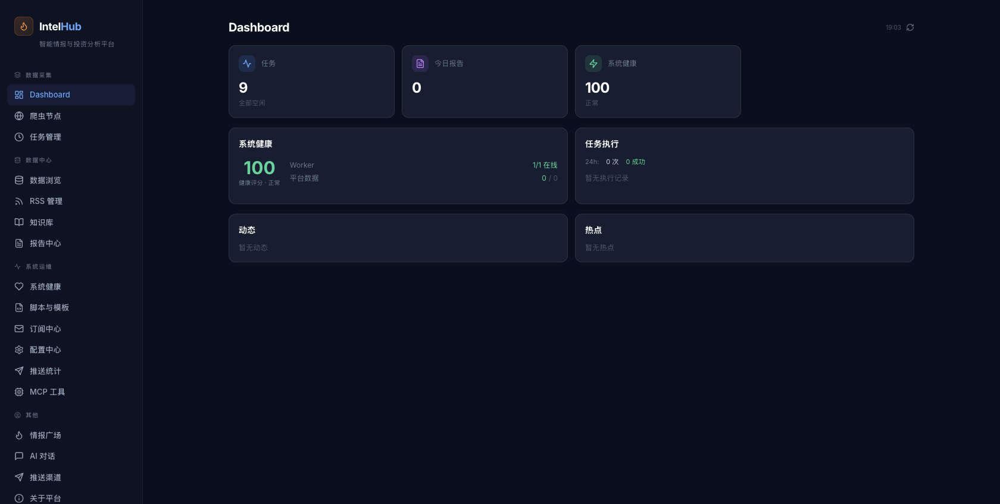

<div align="center">

# IntelHub

### 把全网信息变成可行动的情报

**自动采集 · 智能分析 · 主动推送**

[](https://python.org)
[](https://react.dev)
[](LICENSE)
[](CONTRIBUTING.md)

[English](#english) · [功能](#-功能) · [快速开始](#-快速开始) · [架构](#-架构) · [路线图](#-演进路线) · [Pro 版本](#-intelhub-pro)

</div>

---

## 情报，不止于信息

信息爆炸的时代，数据无处不在，但真正有价值的 **情报** 却淹没在噪音里。

IntelHub 是一个开源的智能情报平台，帮助你：

- **自动采集** 20+ 数据源的实时信息（社交媒体、科技资讯、财经数据、政策法规、交易所公告...）
- **智能分析** 跨平台共振信号，识别趋势与拐点
- **主动推送** 经过 AI 筛选的洞察报告到你的邮箱或 Webhook

不需要登录，不需要配置。`./dev.sh` 一键启动，打开浏览器就是你的私人情报中心。

---

## ✨ 功能

<table>
<tr>
<td width="50%">

### 🔍 情报广场
全网数据聚合，多源情报一站浏览。按任务分类筛选，快速定位关键信息。

</td>
<td width="50%">

### 📊 AI 智能报告
LLM 驱动的多轮分析：跨平台共振 → 趋势识别 → 投资洞察。自动生成可读报告。

</td>
</tr>
<tr>
<td>

### ⏰ 任务自动化
基于 APScheduler 的定时调度引擎。9 个预配置系统任务，开箱即用。支持自定义脚本扩展。

</td>
<td>

### 🔗 多源数据采集
覆盖 9 大热点平台、10 大监管机构、4 大交易所、500+ A 股核心标的。RSS/B站/YouTube 灵活接入。

</td>
</tr>
<tr>
<td>

### 💬 AI 对话
上下文感知的智能问答。基于知识库回答问题，支持 Claude / OpenAI / Ollama 多 LLM 后端。

</td>
<td>

### 📚 知识库
文档管理与向量检索。自动实体抽取 + 关系建模，构建结构化知识图谱。

</td>
</tr>
<tr>
<td>

### 📬 订阅推送
邮件、Webhook 多渠道主动推送。自定义订阅规则，情报主动找到你。

</td>
<td>

### 🔧 MCP 工具
标准化接口连接外部 AI Agent。通过 Model Context Protocol 将情报能力开放给第三方应用。

</td>
</tr>
</table>

---

## 📸 截图

<table>
<tr>
<td></td>
</tr>
<tr>
<td align="center"><em>Dashboard — 系统健康、任务执行、热点追踪一目了然</em></td>
</tr>
</table>

> 欢迎提交更多截图 PR！

---

## 🚀 快速开始

### 环境要求

- Python 3.10+
- Node.js 18+
- Git

### 一键启动

```bash
git clone https://github.com/petterobam/intelhub.git
cd intelhub

# 安装后端依赖
pip3 install -r requirements.txt

# 安装前端依赖
cd frontend && npm install && cd ..

# 初始化系统任务
python3 scripts/seed_db.py
python3 scripts/seed_rss_sources.py

# 一键启动（后端 :18923 + 前端 :18432）
./dev.sh
```

打开 http://localhost:18432 ，开始使用。

> `dev.sh` 支持以下命令：
> `./dev.sh` 启动 · `./dev.sh stop` 停止 · `./dev.sh status` 状态 · `./dev.sh restart` 重启

### 配置 LLM

编辑 `.env` 文件，配置你的 AI 模型：

```bash
# 方案一：Claude（推荐）
ANTHROPIC_API_KEY=sk-ant-xxx

# 方案二：OpenAI
OPENAI_API_KEY=sk-xxx

# 方案三：Ollama（本地部署）
OLLAMA_BASE_URL=http://localhost:11434
```

### 配置推送（可选）

```bash
# SMTP 邮件推送
SMTP_HOST=smtp.gmail.com
SMTP_PORT=587
SMTP_USER=you@gmail.com
SMTP_PASS=app-password
SMTP_FROM=IntelHub <you@gmail.com>
```

---

## 📋 预配置任务

IntelHub 内置 9 个系统级定时任务，覆盖从数据采集到智能分析的全链路：

| 任务 | 模块 | 调度 | 说明 |
|------|------|------|------|
| 热点平台采集 | `hot_topics` | 每 90 分钟 | 微博/抖音/知乎/36kr/虎嗅/东财/澎湃/网易/环球网 |
| 政策监控采集 | `policy` | 每 180 分钟 | 央行/证监会/财政部/国务院/外管局/发改委/工信部 等 10 大机构 |
| 交易所公告采集 | `exchange` | 工作日 9/13/15 点 | 上交所/深交所/北交所/港交所 |
| 巨潮资讯批量采集 | `financial` | 工作日 8/12/16 点 | 500+ 只 A 股：沪深 300 + 中证 500 + 行业龙头 |
| 数据聚合 | `aggregate` | 每 60 分钟 | 汇总各模块采集数据，生成聚合统计 |
| 投资分析心跳 | `analysis` | 每天 9/13/16 点 | LLM 多轮分析：跨平台共振 → 趋势 → 投资洞察 |
| 系统自优化 | `analysis` | 每 60 分钟 | LLM 分析系统健康，生成优化建议 |
| 知识库构建 | `knowledge` | 每 120 分钟 | 实体抽取 + 关系建模 + 索引更新 |
| 系统心跳 | `system` | 每 30 分钟 | 检查系统运行状态和数据新鲜度 |

---

## 🏗 架构

```
┌──────────────────────────────────────────────────────────┐
│                    IntelHub Web UI                        │
│             React 18 + TailwindCSS + Vite                 │
│                   (localhost:18432)                        │
└────────────────────────┬─────────────────────────────────┘
                         │ REST API
┌────────────────────────▼─────────────────────────────────┐
│                 Flask REST API (:18923)                    │
│  ┌──────────┬──────────┬──────────┬──────────┬────────┐  │
│  │  Tasks   │ Crawlers │  Data    │ Reports  │ Chat   │  │
│  └──────────┴──────────┴──────────┴──────────┴────────┘  │
│                  APScheduler 调度引擎                       │
└───────┬────────────┬──────────────┬───────────────────────┘
        │            │              │
   ┌────▼────┐  ┌────▼─────┐  ┌────▼─────┐
   │ Crawlers │  │ Analysis │  │ Knowledge │
   │  20+源   │  │  Engine  │  │   Base    │
   └─────────┘  └──────────┘  └───────────┘
        │            │              │
        ▼            ▼              ▼
   data/raw/    reports/      data/kb/
   原始数据      分析报告       向量索引
```

### 技术栈

| 层级 | 技术 |
|------|------|
| 前端 | React 18, TailwindCSS, Lucide Icons, Recharts, Vite 5 |
| 后端 | Flask, SQLAlchemy, APScheduler, Gunicorn |
| AI | Claude Agent SDK, Anthropic, OpenAI, Ollama |
| 采集 | BeautifulSoup, feedparser, requests |
| 存储 | SQLite (默认), 支持扩展 PostgreSQL |
| 推送 | SMTP, Webhook |

---

## 演进路线

IntelHub 不是静态的工具，而是一个持续进化的情报中枢：

### 当前阶段：广度聚合
多源数据实时采集与统一浏览，AI 自动生成分析报告，多渠道主动推送。

### 下一阶段：深度情报
事件追踪与时间线构建，影响面分析与舆情扩散，趋势信号与拐点预判，日/周/月周期报告。

### 未来方向
- **泛内容挖掘** — 从评论、提问、求助中发现隐藏的需求与机会
- **专家 AI Agent** — 融合多源的领域知识图谱，主动预警与推荐
- **开放生态** — 通过 MCP/Skill 开放情报能力，共建共享情报网络
- **用户共建** — 社区驱动迭代，开放路线图透明规划

---

## 🌟 IntelHub Pro

IntelHub 开源版是完全免费的自部署版本，适合个人研究者和开发者。

如果你需要更强的能力，试试 **[IntelHub Pro](https://www.intelhub.club/)**：

| 特性 | 开源版 | Pro |
|------|--------|-----|
| 数据源 | 20+ 基础源 | 50+ 含海外源 |
| AI 分析 | 需自备 API Key | 内置，开箱即用 |
| 报告生成 | 基础模板 | 高级模板 + 自定义 |
| 推送渠道 | 邮件 + Webhook | + 微信 + 钉钉 + 飞书 |
| 多用户 | 单用户 | 团队协作 |
| 部署 | 自部署 | 云端托管，无需运维 |
| 数据存储 | 本地 | 云端同步 + 历史回溯 |

<div align="center">

**[了解更多 → intelhub.club](https://www.intelhub.club/)**

</div>

---

## 🤝 参与贡献

IntelHub 是开源项目，欢迎各种形式的贡献：

- **反馈需求** — [提交 Issue](https://github.com/petterobam/intelhub/issues) 告诉我们你想要什么
- **贡献代码** — Fork → Branch → PR，我们重视每一个 PR
- **分享经验** — 写文章、做视频、在社区分享你的使用场景
- **数据源扩展** — 提交新的爬虫模块，让 IntelHub 覆盖更多数据源

### 开发指南

```bash
# 1. Fork 并克隆
git clone https://github.com/petterobam/intelhub.git

# 2. 启动开发环境
./dev.sh

# 3. 后端代码在 app/ 目录
#    前端代码在 frontend/ 目录
#    爬虫模块在 crawlers/ 目录
#    分析引擎在 analysis/ 目录

# 4. 提交 PR
```

---

## 📄 License

IntelHub is licensed under the [AGPL-3.0 License](LICENSE).

---

<div align="center">

**把全网信息变成可行动的情报**

[开始使用](#-快速开始) · [反馈需求](https://github.com/petterobam/intelhub/issues) · [Pro 版本](https://www.intelhub.club/)

</div>
